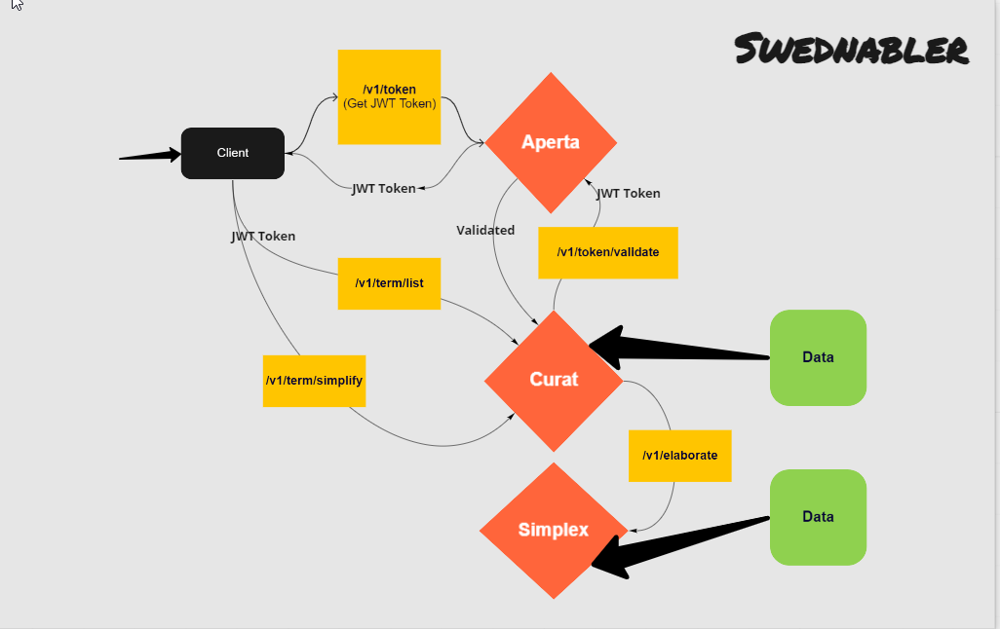

# Swednabler


Swednabler is a microservice based application written in golang that is based on three core values:
* Open
* Caring
* Simple

## Motivation

The motivation behind writing this application is to replicate the values of the Bank. 

Swednabler is a collection of three microservices:
* **[Aperta](./aperta) (Open)**: **Straightforward, honest and reliable** 
    * This microservice expose two endpoints.
    * _/v1/token_ - This token validates the incoming user credentials and then issue a JWT token.
    * The JWT token is short-lived.  
    * User need to use the JWT token  to be able to access other endpoints.
    * _/v1/token/validate_ -  This endpoint validates the JWT token and based on the response other endpoints can decide weather to allow or deny the service.
    * This makes the api calls reliable because the token can only be validated by Aperta (decrypted by the private key) and no one else can decrypt or generate those tokens.

* **[Curat](./curat) (Caring)**: **Be helpful and reliable**
    * This microservice expose two endpoints.
    * _/v1/term/list_ - This service requires the JWT bearer token and validates it against Aperta.
    * The endpoint returns a json response if JWT is validated. Response is a list of terminology terms and each term have an ID attached to it.
    * The idea is to give the user all the help they need when they deal with the Bank, so the service replicates how the Bank help the customer understand bank related terminologies.
    * _/v1/term/simplify_ - This endpoint calls another service Simplex
    
* **[Simplex](./simplex) (Simple)**:  **Easily to access and easy to understand**
    * This microservice expose one endpoint.
    * _/v1/elaborate_ - This endpoint takes id of a term and elaborate more about it like, full_name and description. 
    * This endpoint is called from Curat service and respond the json to Curat.
    * The idea is to simplify things for the user even further so it is easy to access and easy to understand
 
## The flow



## How it is Built?

* The services are written in golang verion 1.19.
* It uses [go-kit](https://github.com/go-kit/kit) standard libraries.

## How to install

### Local development environment

To run and test swednabler locally run the following command

```
# You need to have docker and docker-compose installed
make build-and-run-swednabler
```

### Install to K8s cluster using Manifests

The services can be installed in the k8s cluster and all the relates k8s configuration is placed in [k8s](./k8s) directory.

### Install to K8s cluster using Argo

To install the service using Argo, hook the argo application to the [base](./k8s/config/base) or create overlays if necessary.

### Istio support

Swednabler have manifests for Istio as well, and these service can be run on Istio. One benefit of running it on istio is that you get the mutual tls out of the box.
Install the relates manifest from [Istio](./istio) folder.

## Contributions

### How to Contribute

This project is [Apache 2.0 licensed](LICENSE) and accept contributions via
GitHub pull requests.  This document outlines some of the conventions on
development workflow, commit message formatting, contact points and other
resources to make it easier to get your contribution accepted.

### Certificate of Origin

By contributing to this project you agree to the Developer Certificate of
Origin (DCO). This document was created by the Linux Kernel community and is a
simple statement that you, as a contributor, have the legal right to make the
contribution. See the [DCO](DCO) file for details.

### Getting Started

- Fork the repository on GitHub
- Read the [README](README.md) for build and test instructions
- Play with the project, submit bugs, submit patches!

### Contribution Flow

This is a rough outline of what a contributor's workflow looks like:

- Create a topic branch from where you want to base your work (usually master).
- Make commits of logical units.
- Make sure your commit messages are in the proper format.
- Push your changes to a topic branch in your fork of the repository.
- Create a PR and two jobs will run - one will do the lint and another will run the tests.
- If verification job fails please correct the required changes and commit again.

Thanks for your contributions!

### Coding Style

Please follow the standard GO coding style. Read more about it [here](https://golang.org/doc/effective_go.html)


